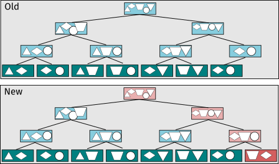

# Saving a SBTMH in IPFS

The SBTMH structure can be encoded as nodes in a MerkleDAG and stored in IPFS (InterPlanetary File System) [Benet, 2014].
Typical data archive systems,
like Amazon S3 or the NCBI SRA,
stop working when the central service is down.
IPFS nodes can communicate and synchronize data without requiring a central source,
and they can also serve data requests among them,
which benefits from local networks  and increases the bandwidth available for data transfers.

The SBTMH behaves like a persistent data structure [Driscoll et al, 1989], 
where new versions of a SBTMH (after new nodes are added or removed) can share parts of the structure of previous versions.
While this is usually used to avoid duplicating data on pure functional programming languages,
for our use case it is important because it allows remixing of indexes and signatures:
users can expand an index with their own signatures,
and share the new index with other users.

Signatures calculated from public datasets can also be shared:
by indexing RefSeq and GenBank and sharing the signatures on IPFS,
users can become curators by selecting organisms of interest and creating SBTMH indexes that fit their needs or the needs of a specific area.

*Adding a new signature to SBTMH causes parent nodes to be updated, but other nodes are not affected. This means users from both SBTMH can benefit from increased availability of the data for the nodes that didn't change (and are shared among trees).*

## Further reading

- [Why][1] use IPFS, and [how][2] it works.
- [Pull request for IPFS storage for SBTMH (includes Redis too)][3]

[1]: https://ipfs.io/#why
[2]: https://ipfs.io/#how
[3]: https://github.com/dib-lab/sourmash/pull/166
